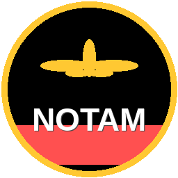

# NOTAM Injector for Microsoft Flight Simulator



A Windows tray application that fetches real-world aviation NOTAMs and reflects relevant conditions live inside Microsoft Flight Simulator 2020/2024 via SimConnect.

---

## What it does

As you fly, the app tracks your aircraft position and continuously fetches active NOTAMs for airports within a configurable radius (default 50 nm). It parses those NOTAMs, classifies them, and where possible applies them directly to the simulator:

| NOTAM type | What happens in MSFS |
|---|---|
| **Obstacle / crane** | A crane SimObject is placed at the real-world coordinates, with beacon lighting toggled based on the NOTAM text. Only placed when within 10 nm of the aircraft. |
| **ILS unserviceable** | ILS is disabled for the affected runway via SimConnect. |
| **VOR / NDB unserviceable** | Navaid is disabled via SimConnect. |
| **Runway closed** | Displayed prominently in the UI and log (SimConnect has no direct runway-close API). |
| **TFR active** | Displayed in the UI with altitude and radius. |

NOTAMs that have no simulator equivalent (taxiway works, lighting tests, chart amendments, etc.) are shown in the NOTAM table for situational awareness but require no sim action.

---

## Features

- **Automatic position tracking** via SimConnect — re-fetches NOTAMs whenever you move more than 5 nm, plus a periodic timer (default every 15 min) so new NOTAMs published mid-flight are picked up
- **Obstacle proximity filter** — objects are placed only when within 10 nm; removed automatically when you fly away or the NOTAM expires
- **Lighting awareness** — parses NOTAM text for day/night marking keywords and toggles the SimObject beacon light accordingly
- **Natural obstacle filtering** — trees, vegetation, hedges etc. are skipped (cannot be represented in MSFS)
- **Multi-source fetching** — notams.online (free, global, no key) + optional CheckWX (free API key)
- **SQLite cache** — NOTAMs are cached locally; stale entries pruned automatically
- **Dark-themed UI** — system tray icon with a debug window showing NOTAMs, MSFS actions, and live log
- **Graceful degradation** — runs on non-Windows or without MSFS open (mock mode logs what would happen)

---

## Screenshots

> Debug window — NOTAMs tab, MSFS Actions tab, and Log tab accessible from the system tray.

---

## Requirements

- Windows 10/11 (64-bit)
- Microsoft Flight Simulator 2020 or 2024
- Python 3.11+ (for running from source) — **not needed for the pre-built `.exe`**
- Internet connection (for NOTAM fetching)

No MSFS SDK or developer tools required.

---

## Running from source

### 1. Clone and set up

```cmd
git clone https://github.com/your-username/msfs-notam-injector.git
cd msfs-notam-injector

python -m venv .venv
.venv\Scripts\activate
pip install -e .
```

### 2. Start MSFS, then run the app

```cmd
python main.py
```

A tray icon appears in the system tray (bottom-right, near the clock). Right-click for the menu; double-click to open the debug window.

---

## Building a standalone `.exe`

```cmd
pip install pyinstaller
pyinstaller build.spec
```

The output is `dist\NotamInjector.exe` — a single file that bundles Python, all dependencies, and `SimConnect.dll`. No installation needed on the target machine.

---

## MSFS model inventory and validation (official-only)

Use this workflow to build and verify obstacle model titles from official MSFS content.

### 1. Scan official inventory roots

```cmd
python scripts/find_msfs_titles.py
```

Outputs:

- `data/simobject_titles_official.txt`
- `data/simobject_folder_candidates_official.txt`

### 2. Validate candidate titles against live SimConnect

Start MSFS and load into a flight, then run:

```cmd
python scripts/validate_msfs_models.py --input data/simobject_titles_official.txt --include-catalog --lat 48.3538 --lon 11.7861 --max 50
```

Output report:

- `data/msfs_model_validation_report.csv`

Use titles with status `ok` to update `obstacle_catalog.yaml` mappings.

---

## Git workflow in terminal (commit + push)

From the project root, run the following commands.

### 1. Verify Git is installed

```powershell
where.exe git
```

If this returns no path, install Git and reopen your terminal:

```powershell
winget install --id Git.Git -e
```

### 2. Check and stage changes

```powershell
git status
git add .
```

### 3. Commit

```powershell
git commit -m "Describe your changes"
```

If identity is not configured yet:

```powershell
git config --global user.name "Your Name"
git config --global user.email "you@example.com"
```

### 4. Push

Check your branch name:

```powershell
git branch --show-current
```

First push on a branch:

```powershell
git push -u origin <branch-name>
```

Next pushes:

```powershell
git push
```

---

## Configuration

Edit `config.yaml` in the application folder:

```yaml
# SimConnect / MSFS
simconnect_enabled: true
position_poll_interval_s: 30       # how often to read aircraft position
notam_radius_nm: 50.0              # fetch NOTAMs for airports within this radius
min_move_nm: 5.0                   # only re-fetch if aircraft moved this far

# NOTAM sources
notams_online_enabled: true        # notams.online (free, no key, global)
checkwx_api_key: ""                # optional – CheckWX key as secondary source

# Behaviour
auto_apply_notams: true            # apply MSFS actions automatically when NOTAMs load
notam_refresh_interval_min: 15     # re-fetch NOTAMs every N minutes regardless of movement
max_notam_age_h: 24                # discard cached NOTAMs older than N hours
obstacle_placement_radius_nm: 10.0 # only place obstacle objects within this range of aircraft

# Logging
log_level: "INFO"                  # DEBUG | INFO | WARNING | ERROR
log_file: "notam_injector.log"
```

---

## NOTAM sources

| Source | Key required | Coverage |
|---|---|---|
| [notams.online](https://notams.online) | No | Global |
| [CheckWX](https://www.checkwx.com) | Yes (free tier) | Global |

Both sources can be enabled simultaneously — results are deduplicated automatically.

---

## Project structure

```
msfs-notam-injector/
├── main.py                   # Entry point
├── config.yaml               # User configuration
├── build.spec                # PyInstaller build config
├── data/                     # airports.csv (downloaded, not in repo)
├── assets/                   # Icon files
├── scripts/
│   └── download_airports.py  # One-time airport DB download
└── src/
    ├── config.py             # Pydantic settings
    ├── scheduler.py          # Central orchestrator
    ├── airports/
    │   └── lookup.py         # Radius-based airport search (haversine)
    ├── notam/
    │   ├── fetcher.py        # HTTP fetchers (notams.online, CheckWX)
    │   ├── parser.py         # ICAO NOTAM text parser
    │   ├── classifier.py     # NOTAM → MSFS action classifier
    │   └── models.py         # Notam / MsfsAction dataclasses + enums
    ├── msfs/
    │   ├── connector.py      # SimConnect position polling
    │   ├── objects.py        # SimObject placement (cranes, obstacles)
    │   └── navaids.py        # ILS / VOR / NDB control
    └── ui/
        ├── tray.py           # System tray icon and menu
        ├── main_window.py    # Debug window
        └── widgets/
            ├── notam_table.py    # NOTAM list
            ├── actions_panel.py  # MSFS actions list
            └── log_panel.py      # Live log viewer
```

---

## Known limitations

- **Runway closures** — SimConnect does not expose a runway-close API. Closures are shown in the UI but not enforced in the sim.
- **TFRs** — Displayed for awareness; not enforced (would require a WASM module).
- **ILS/VOR disabling** — Requires a SimConnect WASM gauge to write the relevant simulation variables; currently logs a warning.
- **Scenery-library obstacle models** — BGL library objects (for example some Community crane packages) cannot be spawned through SimConnect `AICreateSimulatedObject`. The Python app can queue these placements, but an in-sim bridge/WASM backend is still required to render them.
- **Windows only** — SimConnect is Windows-exclusive. The app runs in mock/log-only mode on Linux/macOS.

Queued scenery-library placement intents are written to [data/scenery_library_queue.json](data/scenery_library_queue.json). See [docs/scenery_library_bridge_contract.md](docs/scenery_library_bridge_contract.md) for the bridge contract.

For local debugging, you can watch queue changes with:

```cmd
python scripts/watch_scenery_queue.py
```

---

## License

MIT
